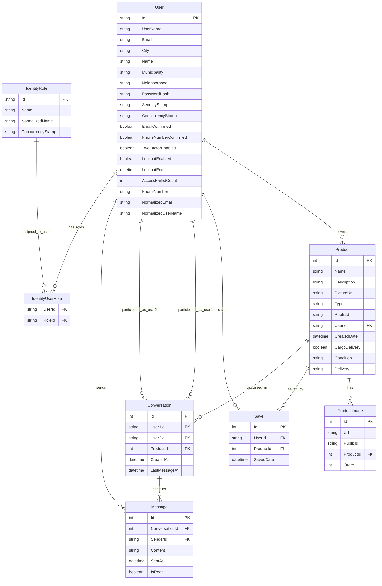

# Entity Relationship Diagram - Diplomska Project



## 📊 **How to Use This ER Diagram**

### **1. Viewing the Diagram**

**Option A: GitHub/GitLab (Recommended)**
- Copy the entire content above
- Paste it into a `.md` file in your repository
- GitHub and GitLab will automatically render the Mermaid diagram

**Option B: VS Code**
- Install the "Mermaid Preview" extension
- Open the `.md` file and use `Ctrl+Shift+P` → "Mermaid Preview"

**Option C: Online Mermaid Editor**
- Go to [mermaid.live](https://mermaid.live)
- Paste the mermaid code (everything between the ```mermaid tags)
- View and export the diagram

### **2. Understanding the Diagram**

#### **Entity Types:**
- **Rectangles** = Tables/Entities
- **Fields** = Columns in each table
- **PK** = Primary Key
- **FK** = Foreign Key

#### **Relationship Types:**
- **||--o{** = One-to-Many (1 user owns many products)
- **||--||** = One-to-One (1 order has 1 shipping address)
- **o{--o{** = Many-to-Many (users can save many products)

### **3. Key Relationships Explained**

#### **User-Centric Relationships:**
```
User → Products (1:Many)     - Users can own multiple products
User → Saves (1:Many)       - Users can save multiple products  
User → Conversations (1:Many) - Users participate in multiple conversations
User → Messages (1:Many)    - Users can send multiple messages
```

#### **Product-Centric Relationships:**
```
Product → ProductImages (1:Many) - Products can have multiple images
Product → Saves (1:Many)         - Products can be saved by multiple users
Product → Conversations (1:Many)  - Products can have multiple conversations
```

#### **Messaging System:**
```
Conversation → Messages (1:Many) - Conversations contain multiple messages
Conversation → User1 (Many:1)    - Conversations have a first user
Conversation → User2 (Many:1)    - Conversations have a second user
```

### **4. Database Design Insights**

#### **Marketplace Model:**
- **No Shopping Cart** - Users don't add items to baskets
- **Direct Communication** - Buyers contact sellers via messaging
- **Save/Wishlist** - Users can save products they're interested in
- **No Order System** - Transactions handled outside the application

#### **ASP.NET Identity Integration:**
- **User Management** - Built-in authentication and authorization
- **Role-Based Access** - Users have "Member" role
- **Security Features** - Password hashing, lockout, two-factor auth support

### **5. Using for Development**

#### **Adding New Features:**
1. **Identify affected entities** from the diagram
2. **Check relationships** to understand data flow
3. **Plan migrations** based on schema changes
4. **Update controllers** to handle new relationships

#### **Database Optimization:**
1. **Index foreign keys** (UserId, ProductId, ConversationId)
2. **Consider denormalization** for frequently accessed data
3. **Plan for scaling** based on relationship patterns

#### **API Design:**
1. **Follow entity relationships** in your API endpoints
2. **Include related data** using Entity Framework's Include()
3. **Respect data boundaries** based on ownership relationships

### **6. Maintenance**

#### **Keep Updated:**
- **Update diagram** when adding new entities
- **Document changes** in migration comments
- **Review relationships** during code reviews
- **Validate constraints** match diagram relationships

This ER diagram serves as your **database blueprint** and should be referenced whenever you're working with data relationships in your application! 🎯
